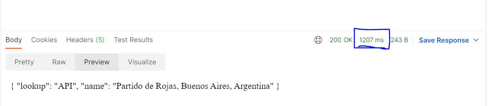
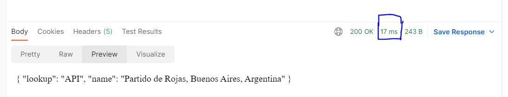

# Flask in Memory implemenation for API Caching

# Start service
### docker-compose up -d --build
#### The above command with run 2 docker containers , Flask application and Redis for request caching.

# How to test the Application
#### Use API tools for sending request to url 
##### localhost:5000/get_address/-34.44076/-60.70521
#### When the first request is hit , the response is processed within application and it may take more time to respond. When the same request is reinitated then it will lookup in cache and provide a faster cached response.

##### API response time images are attached for reference before and after implemenataion.

# Run unit test
### python -m unittest  ( Already added as a step in docker file)

## Unit test report 

# API Cache Implementation Architechture Diagram

# Evidences on performance improvement before and after implementation
## Before Cache implementation
### Response time is high

## After cache implementation
### Response time is reduced to higher extend

## In Memory records for request cache
### All requests are cached in redis db for faster results with expiration
